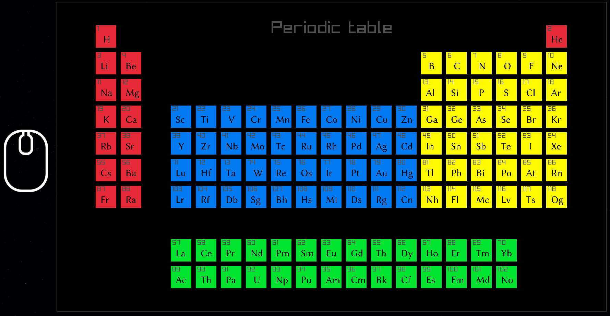

Starting a simple periodic table.



```console
$ gcc -o ptable ptable.c -lraylib
```

# Resources

- Periodic table - [https://en.wikipedia.org/wiki/Periodic_table](https://en.wikipedia.org/wiki/Periodic_table)
- [https://gist.githubusercontent.com/GoodmanSciences/c2dd862cd38f21b0ad36b8f96b4bf1ee/raw/1d92663004489a5b6926e944c1b3d9ec5c40900e/Periodic%2520Table%2520of%2520Elements.csv](https://gist.githubusercontent.com/GoodmanSciences/c2dd862cd38f21b0ad36b8f96b4bf1ee/raw/1d92663004489a5b6926e944c1b3d9ec5c40900e/Periodic%2520Table%2520of%2520Elements.csv)
